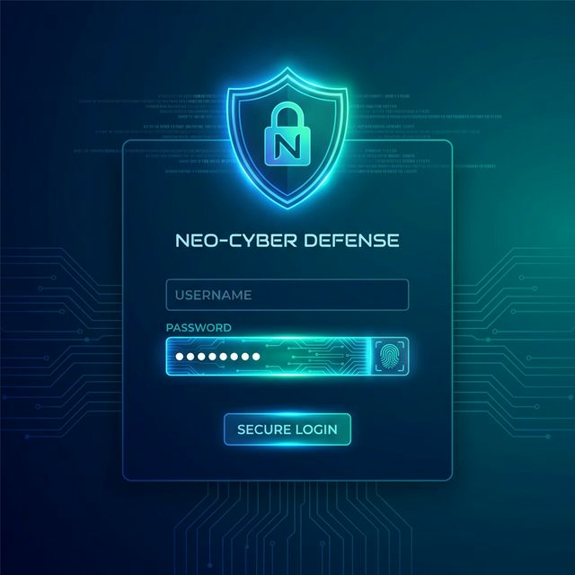

# SafeSphere 🛡️

**Global Open-Source Security Awareness Platform**

SafeSphere is a modern, gamified cybersecurity awareness platform designed to educate users, simulate phishing attacks, and track security posture through interactive dashboards. Built with a focus on "AntiGravity" design principles—clean, futuristic, and engaging.



## 🚀 Features

### 🛡️ Core Security
- **Phishing Simulations**: Create and launch realistic phishing campaigns to test user vigilance.
- **Training Hub**: Interactive modules with video content, reading materials, and quizzes.
- **Risk Scoring**: Real-time calculation of user and organization vulnerability scores.

### 🎮 Gamification & Engagement
- **Achievements**: Unlock badges (e.g., "Phish Slayer", "Iron Wall") for completing trainings and reporting threats.
- **Leaderboard**: Compete with colleagues to become the top "Security Champion".
- **User Dashboard**: Personalized progress tracking and "Next Steps" recommendations.

### 📊 Admin Power Tools
- **Campaign Builder**: Drag-and-drop interface to design email templates and schedule attacks.
- **Analytics Dashboard**: High-level view of organization risk, click rates, and reporting trends.
- **User Management**: Role-based access control (Admin, Trainer, User).

## 🛠️ Tech Stack

- **Frontend**: React 18, Vite, TailwindCSS v4, Framer Motion, Recharts, Lucide Icons.
- **Backend**: FastAPI (Python 3.9+), SQLAlchemy (Async), Pydantic, JWT Auth.
- **Database**: PostgreSQL (Production) / SQLite(Async) (Local Dev).
- **DevOps**: Docker, Docker Compose.

## 🏁 Getting Started

You can run SafeSphere either using Docker (recommended for production/consistency) or locally for development.

### Option 1: Docker (Recommended)

Prerequisites: Docker Engine & Docker Compose.

1. **Clone the repository:**
   ```bash
   git clone https://github.com/boniyeamincse/SafeSphere.git
   cd SafeSphere
   ```

2. **Start the application:**
   ```bash
   docker-compose up --build
   ```

3. **Access the App:**
   - Frontend: `http://localhost:5173`
   - Backend API Docs: `http://localhost:8000/docs`

### Option 2: Local Development

If you don't have Docker or want to develop rapidly with hot-reloading.

**Backend:**
1. Navigate to backend:
   ```bash
   cd backend
   ```
2. Create virtual env & install dependencies:
   ```bash
   python -m venv venv
   source venv/bin/activate  # or venv\Scripts\activate on Windows
   pip install -r requirements.txt
   pip install aiosqlite # For local SQLite support
   ```
3. Run the development server (configured for SQLite):
   ```bash
   ../run_backend_local.sh
   ```

**Frontend:**
1. Navigate to frontend:
   ```bash
   cd frontend
   ```
2. Install dependencies:
   ```bash
   npm install
   ```
3. Start Vite server:
   ```bash
   npm run dev
   ```

## 📂 Project Structure

```
SafeSphere/
├── backend/                 # FastAPI Application
│   ├── app/
│   │   ├── models/          # SQLAlchemy Database Models
│   │   ├── routes/          # API Endpoints
│   │   ├── schemas/         # Pydantic Data Schemas
│   │   └── utils/           # Helper functions (Auth, Hashing)
│   ├── Dockerfile
│   └── requirements.txt
├── frontend/                # React Application
│   ├── src/
│   │   ├── components/      # Reusable UI Components (Sidebar, Layout)
│   │   ├── pages/           # Application Views (Dashboard, Login, etc.)
│   │   └── assets/          # Images and Icons
│   └── vite.config.js
├── database/                # SQL Init Scripts
└── docker-compose.yml       # Container Orchestration
```

## 🤝 Contribution

Contributions are welcome! Please follow these steps:
1. Fork the project.
2. Create your feature branch (`git checkout -b feature/AmazingFeature`).
3. Commit your changes (`git commit -m 'Add some AmazingFeature'`).
4. Push to the branch (`git push origin feature/AmazingFeature`).
5. Open a Pull Request.

## 📄 License

Distributed under the MIT License. See `LICENSE` for more information.

---

*Built with ❤️ for a safer digital world.*
